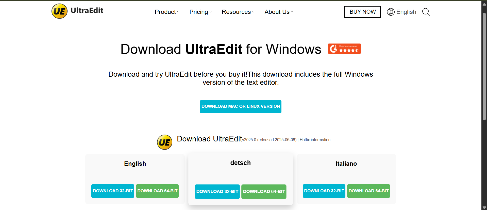

# UltraEdit Clone 💻

A front-end clone of the official UltraEdit website using HTML and CSS. This project focuses on layout structure, styling, and visual presentation, inspired by UltraEdit’s homepage.

## Features

• Custom navigation bar  
• Download button section  
• Clean design layout and typography  
• Multiple sections styled using Flexbox and Grid  
• Animation on cards and buttons  

## Technologies Used

• HTML5  
• CSS3  

## Screenshots

Homepage View  

## Note

This is a static project for educational purposes. It does not include backend functionality or full responsiveness.
